# À la découverte des outils de CI/CD AWS: “CodeSeries” - live coding

---

Sommaire
=================

<!--ts-->

- [Introduction](#introduction)
  * [Description du contenu du repo](#description-du-contenu-du-repo)
- [Exécution du code d'infra](#exécution-du-code-dinfra)
  * [Pré-requis](#pré-requis)
  * [Exécution](#exécution)
- [Step by step](#step-by-step)
  * [1. Création de l'infra initiale](#1-création-de-linfra-initiale)
  * [2. Création d'une pipeline "hello-world"](#2-création-dune-pipeline-hello-world)
  * [3. Mise en place du stage de build](#3-mise-en-place-du-stage-de-build)
  * [4. Mise en place du stage de déploiement en staging](#4-mise-en-place-du-stage-de-déploiement-en-staging)
  * [5. Mise en place du stage de déploiement en production](#5-mise-en-place-du-stage-de-déploiement-en-production)
  * [6. Suppression de l'infra](#6-suppression-de-linfra)

---

# Introduction

Ce repo sert de support au slot KED du 05/07/2021: "À la découverte des outils de CI/CD AWS: “CodeSeries” - live coding".

Lors de ce slot, nous avons réalisé la pipeline de CI/CD suivante pour une application Java "hello-world":

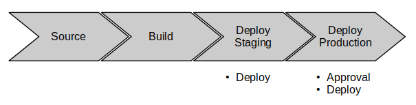

Les environnements de "staging" et de "production" sont créées à partir des mêmes templates `CloudFormation` et voici l'architecture d'un environnement :

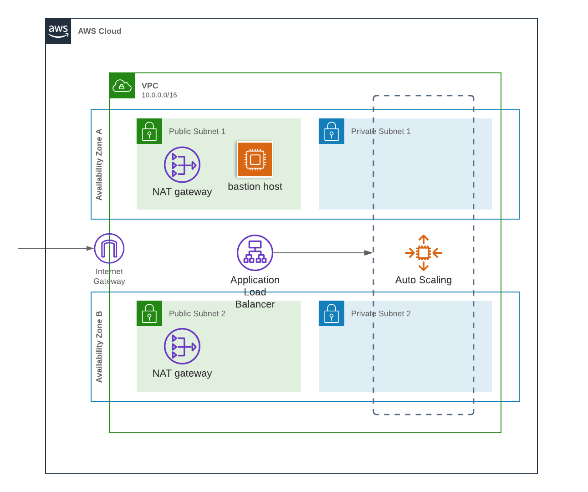

## Description du contenu du repo

```shell
.
├── buildspec.yml                         # configuration du projet `CodeBuild`
├── deployment                            # fichiers liés à `CodeDeploy` et plus généralement au déploiement                                  
│   ├── application.service               # description du service `SystemD` pour les déploiement dans EC2
│   ├── appspec.yml                       # configuration de `CodeDeploy`
│   └── scripts                           # scripts éxécutés dans les "lifecycle hooks", par `CodeDeploy`, dans le cadre du déploiement dans EC2
├── docs                                  # screenshots pour le README
├── infra                                 # code d'infra, `CloudFormation`, `Makefile` et quelques scripts shell
│   ├── [...]
│   ├── infra.env                         # variables d'environnement à définir pour pouvoir créer les ressources d'infra
│   ├── Makefile                          # targets de création et de suppression de l'infra
│   └── master-stack.yml                  # template `CloudFormation` de création de toute l'infra
│   ├── master-stack-parameters.json      # paramètres utilisés pour créer toute l'infra
├── pom.xml                               # configuration `Maven` du projet applicatif
├── README.md
└── src
    ├── main                              # code source "de prod"
    └── test                              # code source "de test"
```

# Exécution du code d'infra

## Pré-requis

- aws cli: [https://docs.aws.amazon.com/cli/latest/userguide/install-cliv2.html](https://docs.aws.amazon.com/cli/latest/userguide/install-cliv2.html)
- make: [https://www.gnu.org/software/make/](https://www.gnu.org/software/make/)

## Exécution

```shell
cd infra
make all APPLICATION_NAME=ked
```

# Step by step

## 1. Création de l'infra initiale

- Forkez le repo [https://github.com/mbimbij/ked-codeseries](https://github.com/mbimbij/ked-codeseries)
- Dans `infra/infra.env`:
  - pour la variable `GITHUB_REPO`, remplacez "mbimbij" par votre username github
  - redéfinissez les variables `SSH_KEY_NAME` et `SSH_KEY_PATH` si besoin 
- checkout le tag: `1-live-coding-starting-point`

cf section [Exécution](#exécution) pour éxécuter les scripts d'infra:

```shell
cd infra
make all APPLICATION_NAME=ked
```

Attendez patiemment que l'infra initiale soit créée 

## 2. Création d'une pipeline "hello-world"

branche de départ: `1-live-coding-starting-point`

branche d'arrivée: `2-hello-world-pipeline`

cf section [Exécution](#exécution) pour éxécuter les scripts d'infra correspondant au manipulations de cette étape:

```shell
cd infra
make all APPLICATION_NAME=ked
```

Place aux manips !

---

1. Dans la console AWS, accédez au service `CodePipeline` et cliquez sur "Create Pipeline":

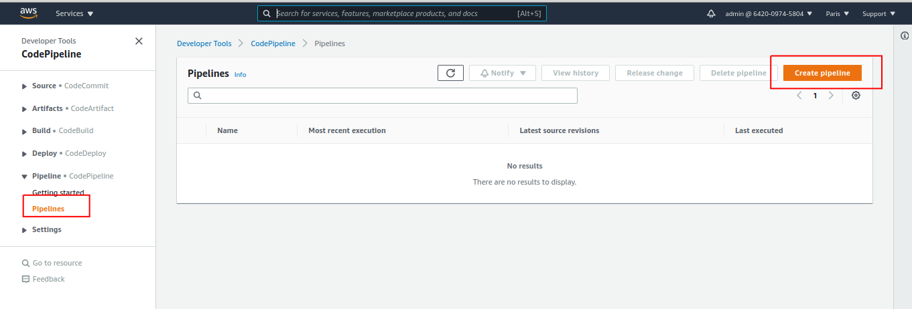

2. **Pipeline name** : "ked". \
   Laissez tous les autres paramètres par défaut, cliquez sur "Next":

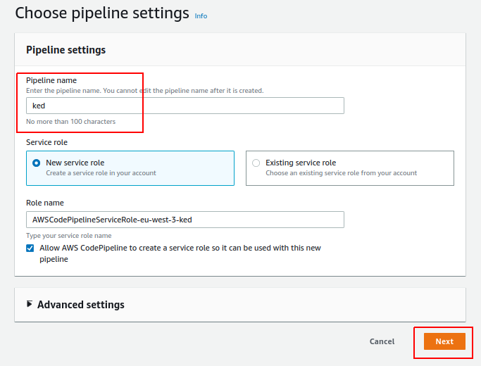

3. **Source provider** : "Github (version 2)". \
  Ensuite cliquez sur "Connect to Github"

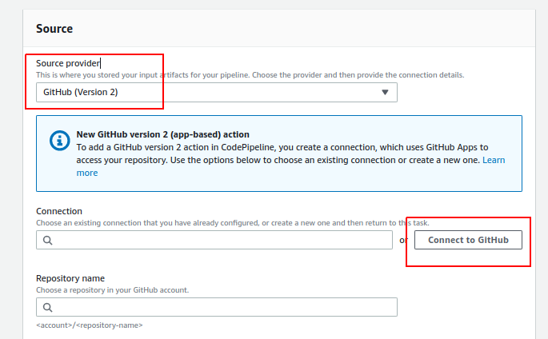

4. **Connection name** : "ked". \
Cliquez sur "Connect to GitHub"

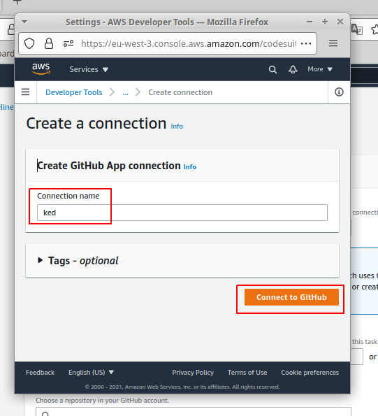

5. Cliquez sur **Authoriza AWS Connector for GitHub** : "ked". 

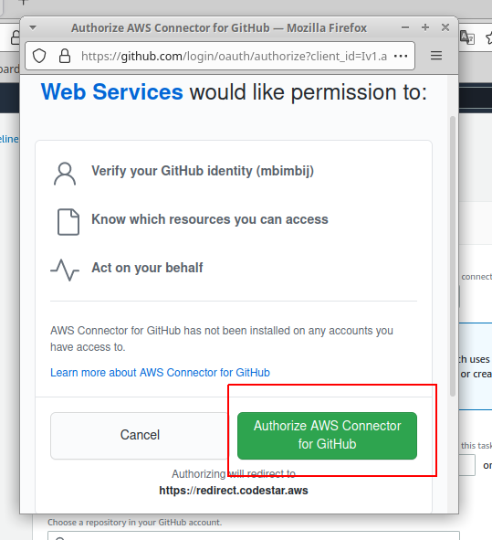

6. Cliquez sur **Install a new app** : "ked". \
   Pour créer une connexion github, il faut encore créer une "Github application", si vous n'en avez pas deja une.
   


7. **Only select repositories**. Sélectionnez le repo que vous avez forké, cliquez sur "Install":

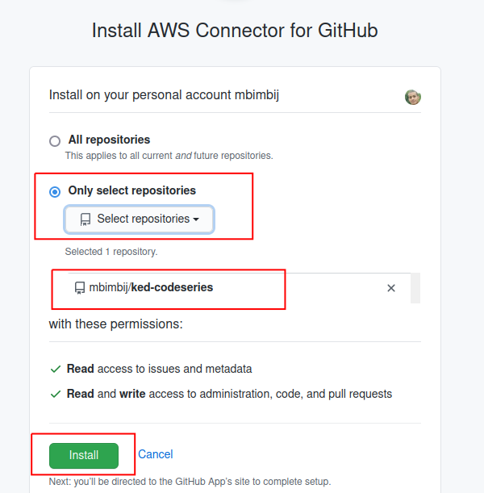

8. Cliquez sur **Connect**

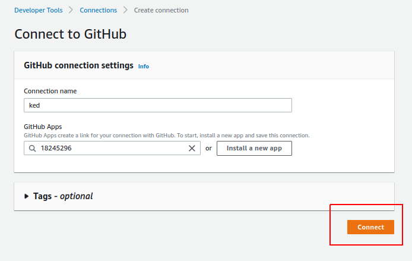

9. **Repository name**: "$GithubUserName/ked-ocdeseries". \
   **Branch name**: "main", "live coding" ou toute autre branche. \
   Cochez **Start the pipeline on source code change**. \
   Cliquez sur "Next"

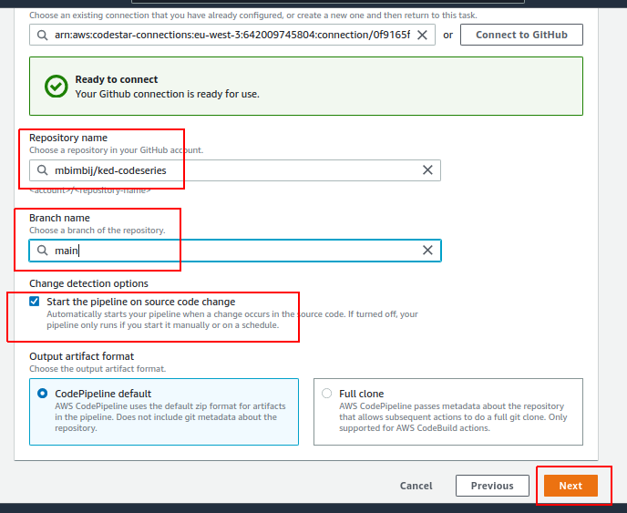

10. **Build provider**: "AWS CodeBuild". \
  Cliquez sur "Create project"

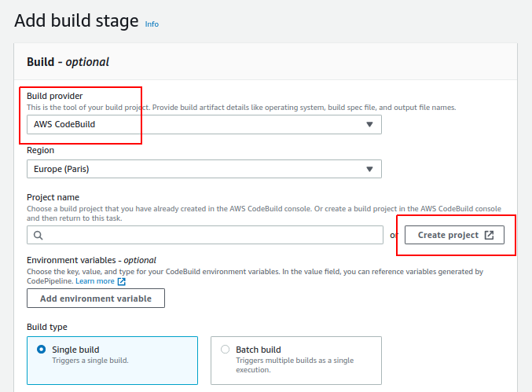

11. **Projet name**: "ked"

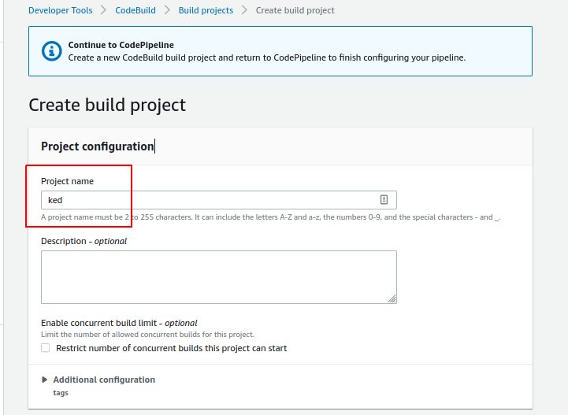

12. Descendez, \
    **Operating system**: "Amazon Linux 2" \
    **Runtime(s)**: "Standard" \
    **Image**: "aws/codebuild/amazonlinux2-x86_64-standard:3.0"

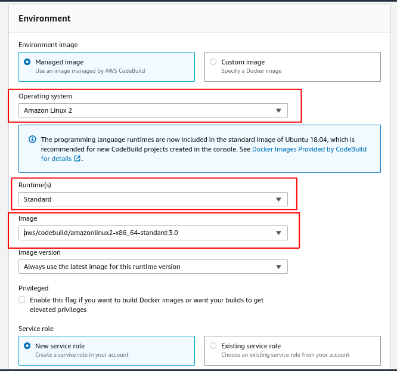

13. Descendez, \
    **Build specifications**: "Insert build commands" \
    **Build commands**: "echo coucou"

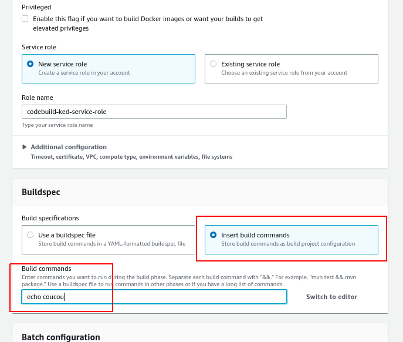

14. Descendez et cliquez sur **Continue to CodePipeline**

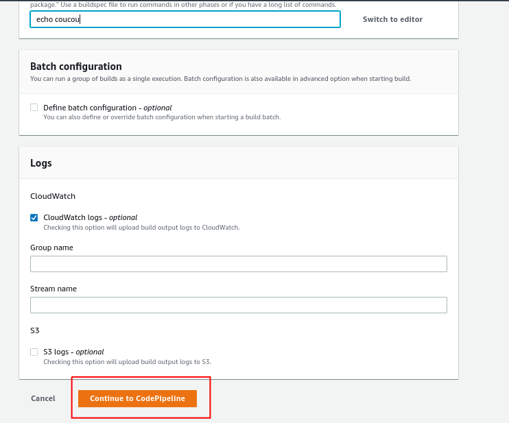

15. Vous êtes redirigé sur le wizard de `CodePipeline`. Cliquez sur "Next"

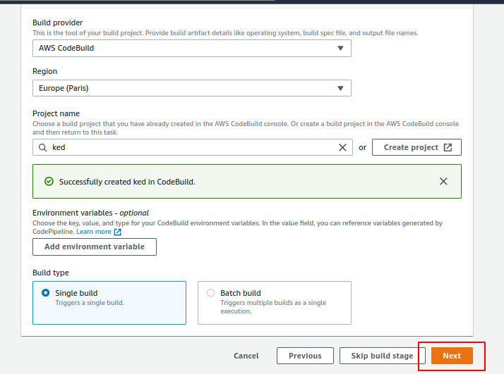

16. Cliquez sur **Skip deploy stage**

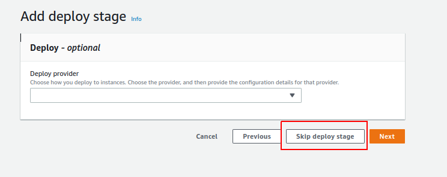

17. Cliquez sur **Create pipeline**

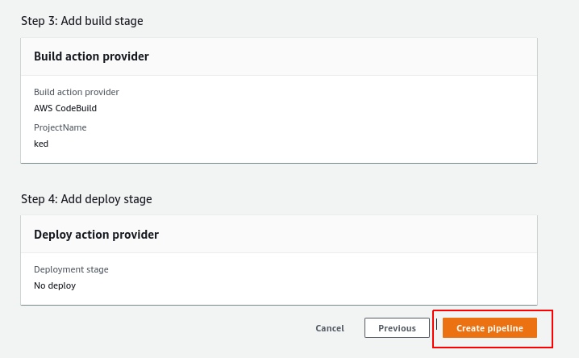

18. La pipeline sera automatiquement éxécutée. Elle devrait être verte. \
    Cliquez sur "AWS CodeBuild"

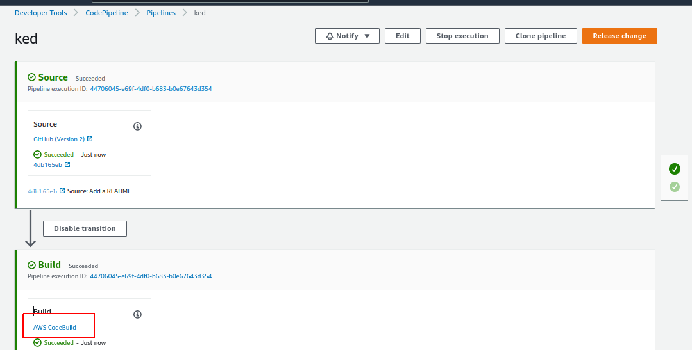

19. Vous êtes redirigé vers l'interface de `CodeBuild`. Cliquez sur le "Build run" 

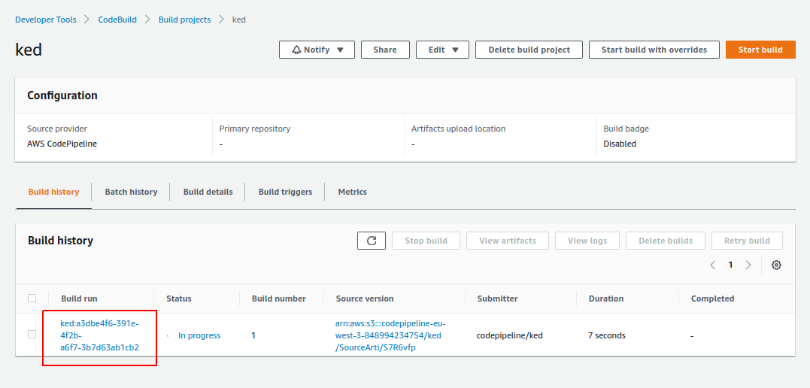

20. Desendez pour observer les logs de build, vous devriez voir l'éxécution de la commande `echo coucou`

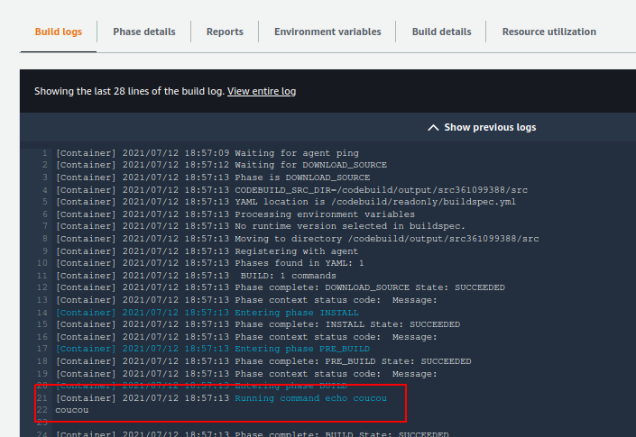

21. Le code source a été poussé dans S3 en tant que "Source Artifact", allons y jeter un oeil. \
    **Note:** le lien dans l'interface risque de vous rediriger vers `CodePipeline`, au lieu de S3. Dans ce cas allez directement dans l'interface de S3.

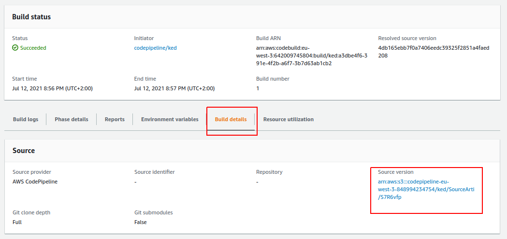

22. Téléchargez l'artefact (zippé dans S3)

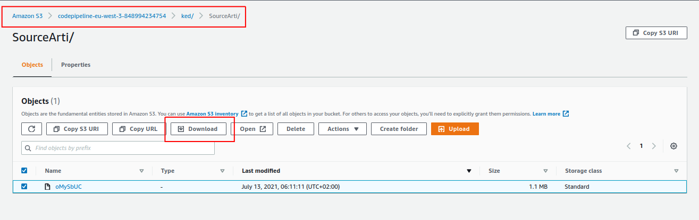

23. inspecter le `.zip`, cela correspond bien à notre code source !

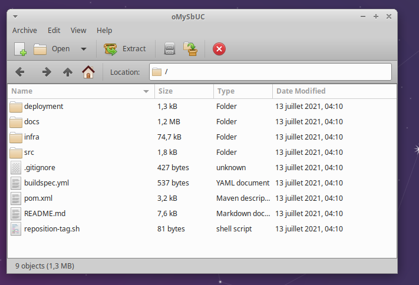


Félicitations, vous avez mis en place une pipeline "Hello World".

Dans la prochaine étape, nous allons builder pour le vrai notre application dans le stage de "Build".

## 3. Mise en place du stage de build

branche de départ: `2-hello-world-pipeline`

branche d'arrivée: `3-pipeline-proper-build`

cf section [Exécution](#exécution) pour éxécuter les scripts d'infra correspondant au manipulations de cette étape:

```shell
cd infra
make all APPLICATION_NAME=ked
```

Place aux manips !

---

Nous allons modifier le projet `CodeBuild` afin de péramétrer le build par le fichier `buildspec.yml` à la racine du code source.

1. Dans l'interface du projet `CodeBuild`, cliquez sur **edit** -> **Buildspec**

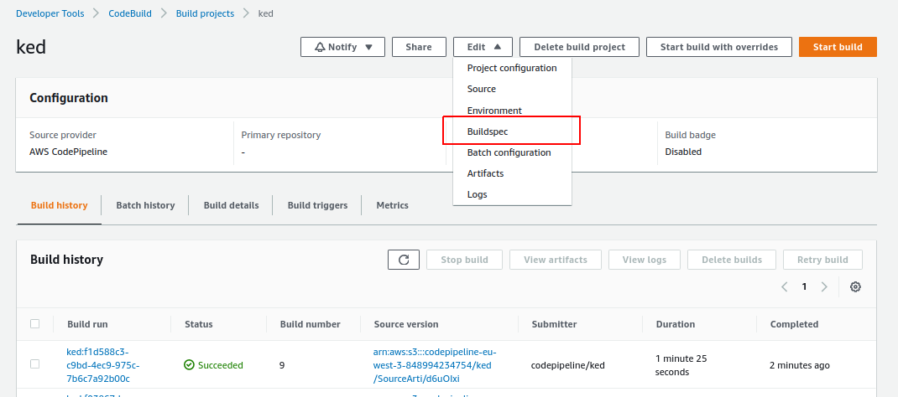

2. **Build specifications**, passez de **Insert build commands** à **Use a buildspec file**. \
    Par défaut, `CodeBuild` recherche un fichier `buildspec.yml` à la racine du code source, et c'est ce que nous allons faire. Du coup laissons le champ vide

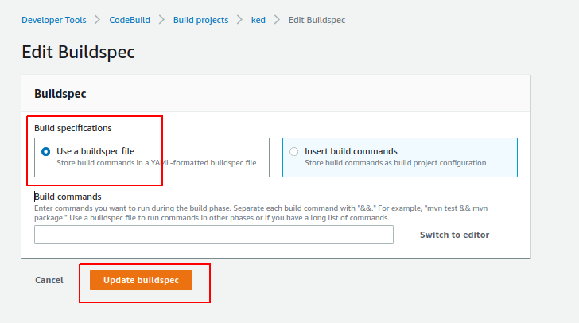

Nous allons maintenant rajouter un cache pour le build:

3. Dans l'interface du projet `CodeBuild`, cliquez sur **edit** -> **Artifacts**

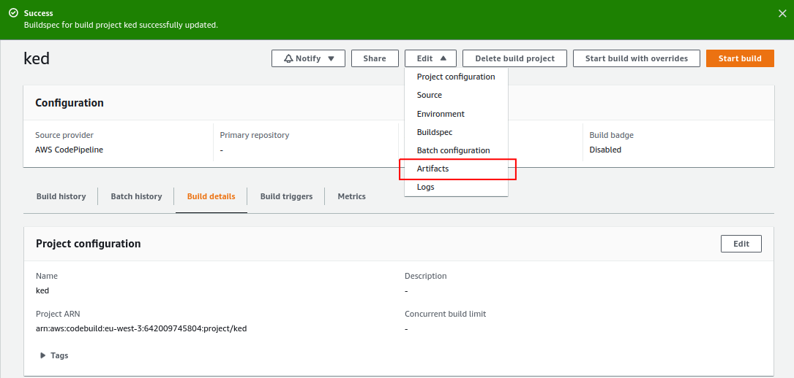

4. Cliquez sur **Additional configuration** \
   **Cache type**: "Amazon S3" \
   **Cache bucket**: le bucket créé par `CodePipeline`, spécifique à votre cas \
   **Cache path prefix**: "maven-cache" \
   Cliquez ensuite sur **Update artifacts**

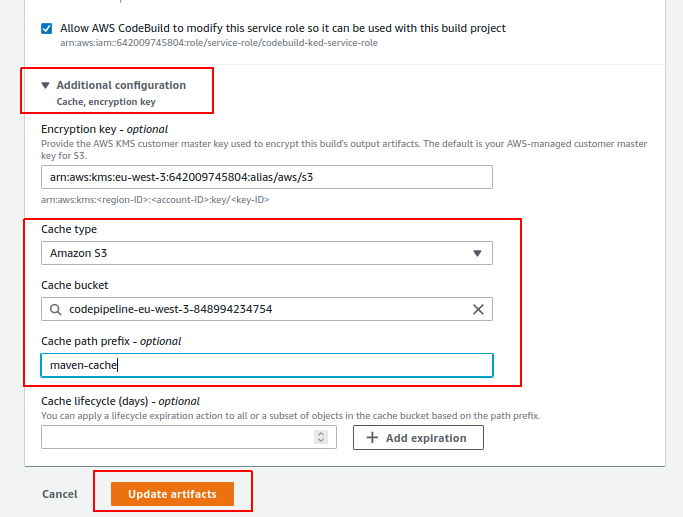

Nous n'avons pas encore de fichier `buildspec.yml` cependant. Nous allons en créer un avant de relancer la pipeline.

Créez le fichier `buildspec.yml` suivant, à la racine du projet:

```yaml
version: 0.2
phases:
  install:
    runtime-versions:
      java: corretto11
  build:
    commands:
      - mvn clean package
reports:
  UnitTests:
    files:
      - 'target/surefire-reports/TEST*.xml'
  CoverageReport:
    files:
      - 'target/site/jacoco/jacoco.xml'
    file-format: 'JACOCOXML'
artifacts:
  files:
    - '**/*'
cache:
  paths:
    - '/root/.m2/**/*'
```

- `version`: la version de la spec utilisée
- `phases`: les actions à effectuer lors des différentes phases
  - `phases.install`: on installe une JDK11. "Corretto" est une JDK managée par AWS
  - `phases.build`: les commandes à éxécuter lors de la phase build
- `reports`: la configuration de rapports de tests et de couverture de tests
  - `reports.UnitTests`: créer un rapport, dont le nom sera "$BuildProjectName-UnitTests", et dont le contenu est spécifié dans les fichiers listés dans `files`. Par défaut le format est `JUNITXML`, on n'a donc pas besoin de le spécifier dans notre cas.
  - `reports.CoverageReport`: créer un rapport, dont le nom sera "$BuildProjectName-CoverageReport". On spécifie le format est `JACOCOXML`.
- `artifacts`: on spécifie les fichiers à utiliser pour créer l'artefact de sortie. Ici pour faire simple, on récupère absolument tous les fichiers
- `cache`: on a configuré un cache dans l'une des étapes précédentes. Ici on spécifie que l'on souhaite mettre le repo `Maven` local dans le cache S3
  
Voir la documentation du buildspec: [https://docs.aws.amazon.com/codebuild/latest/userguide/build-spec-ref.html#build-spec-ref-name-storage](https://docs.aws.amazon.com/codebuild/latest/userguide/build-spec-ref.html#build-spec-ref-name-storage)
Ici la documentation des rapports de test: [https://docs.aws.amazon.com/codebuild/latest/userguide/test-reporting.html](https://docs.aws.amazon.com/codebuild/latest/userguide/test-reporting.html)

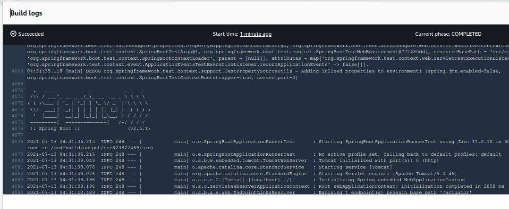


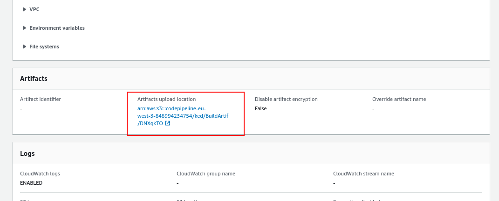


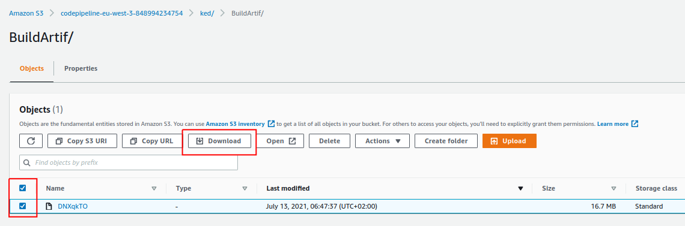


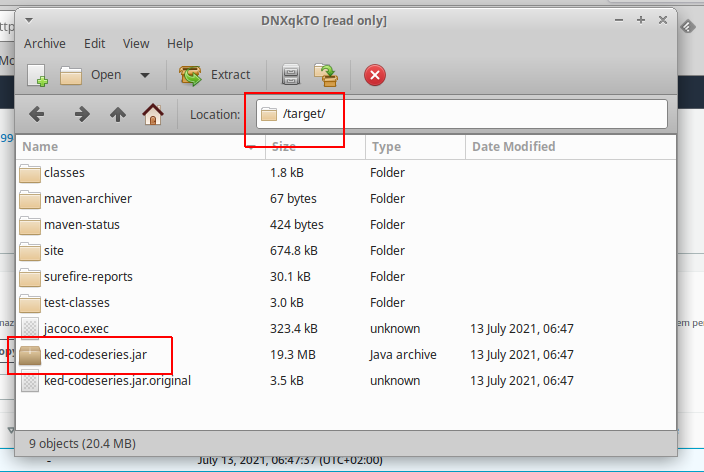

## 4. Mise en place du stage de déploiement en staging

branche de départ: `3-pipeline-proper-build`

branche d'arrivée: `4-deploy-staging`

cf section [Exécution](#exécution) pour éxécuter les scripts d'infra correspondant au manipulations de cette étape:

```shell
cd infra
make all APPLICATION_NAME=ked
```

Le but de cette section est de déployer notre application dans notre environnement de staging. Pour cela nous allons:
1. créer un rôle IAM pour `CodeDeploy`
2. créer une "application" `CodeDeploy` et un "groupe de déploiement" associé
3. ajouter un stage de déploiement en staging dans notre pipeline
4. rajouter les fichiers liés au déploiement
   1. `appspec.yml` pour `CodeDeploy`
   2. scripts shell pour l'agent `CodeDeploy`
   3. fichier `.service` pour déployer notre application en tant que service `SystemD`
5. effectuer le déploiement et tester

Place aux manips !

### 4.1 Création du rôle IAM
Contrairement à `CodeBuild`, le wizard de la console web ne propose pas de créer automatiquement un rôle quand on crée une application `CodeDeploy` ou un groupe de déploiement.
Nous devons donc le créer manuellement à côté.

1. Dirigez vous vers la console du service `IAM` \
     Allez dans "roles" comme indiqué dans la capture

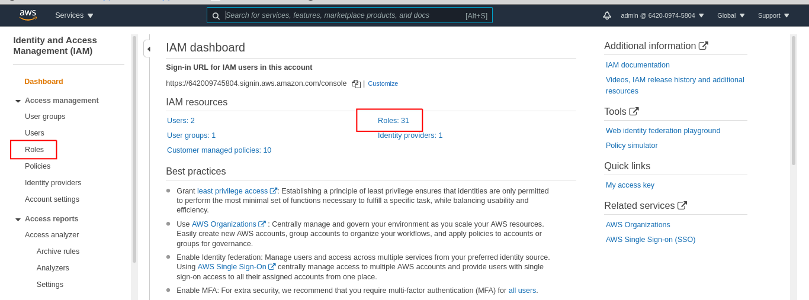

2. Cliquez sur "Create role"

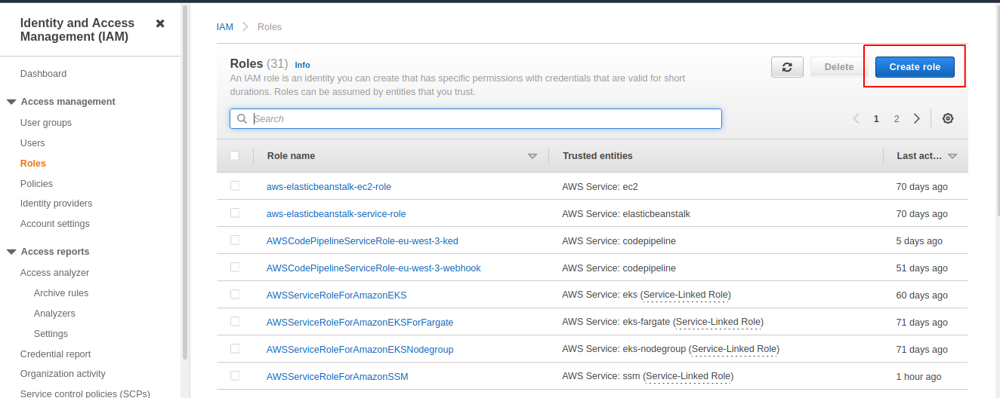

3. Sélectionnez le use case "CodeDeploy"
 
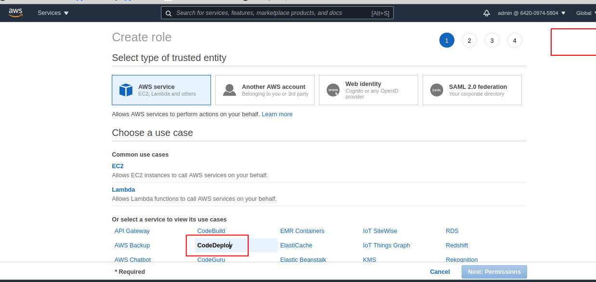

4. Descendez et sélectionnez à nouveau "CodeDeploy", qui correspond à un déploiement dans EC2. Comme vous pouvez le voir, on peut aussi déployer dans `ECS` ou encore `Lambda`
 
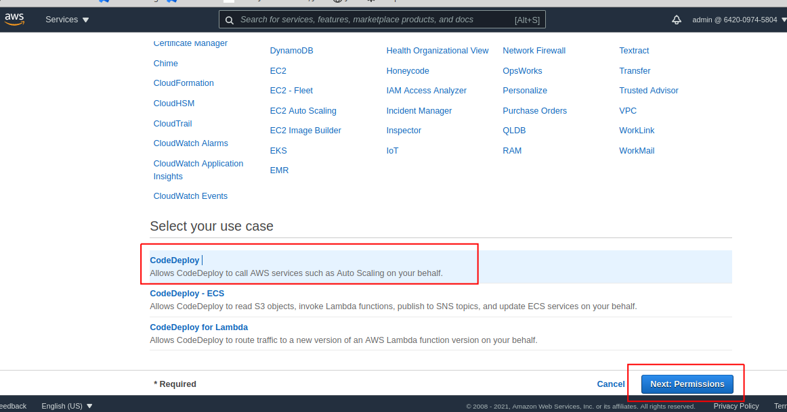

5. Cliquez sur "Tags"
 
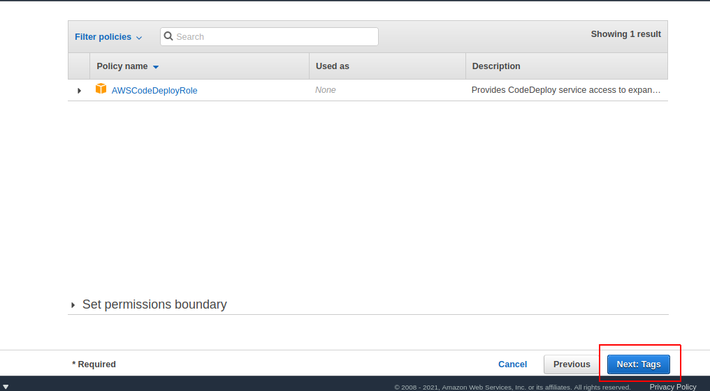

6. Cliquez sur "Review"
 
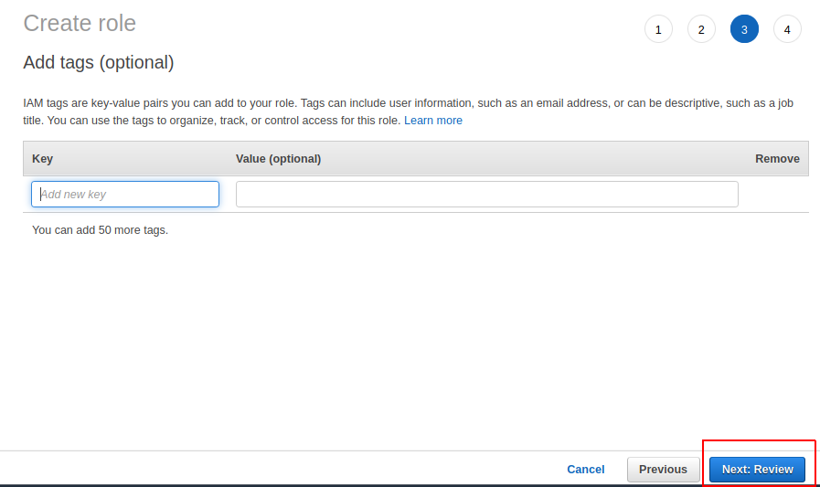

7. Rentrez un nom au rôle, par exemple "ked-deploy-role" \
     Cliquez enfin sur "Create role" 
 
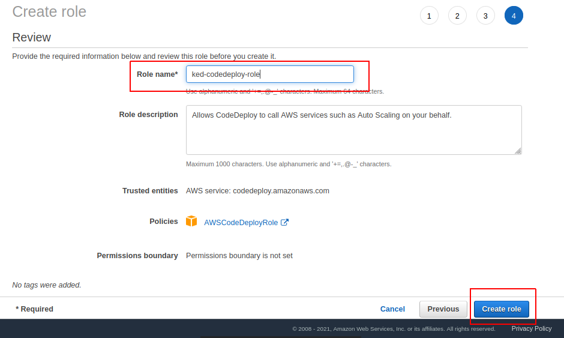

8. L'interface nous affiche que le rôle a bien été créé
 
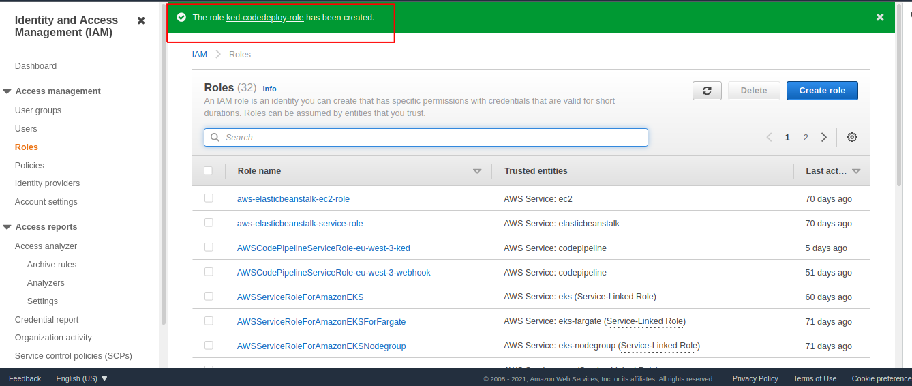

### 4.2 Création de l'application `CodeDeploy` et du groupe de déploiement "staging"

Maintenant nous allons créer l'application `CodeDeploy` et un groupe de déploiement pour déployer en staging.

1. Dirigez-vous dans l'interface du service `CodeDeploy` \
     cliquez sur "Applications"
 
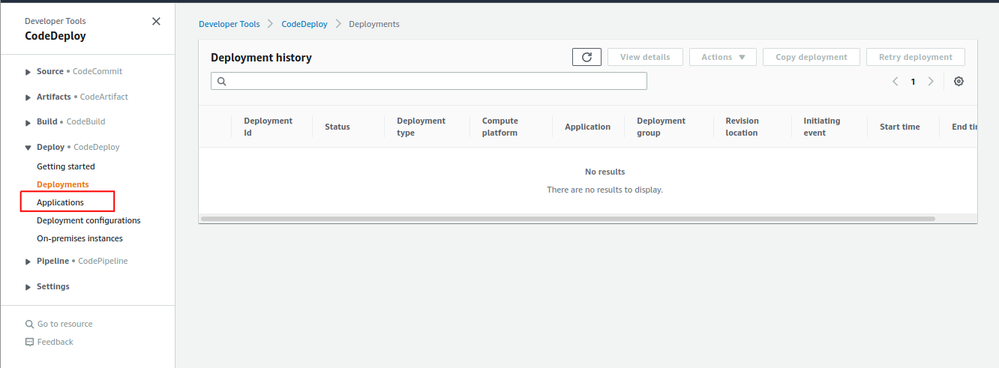

2. Cliquez sur "Create application"
 
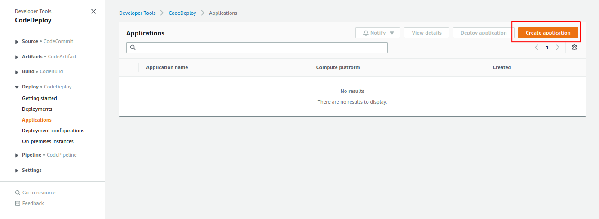

3. Remplissez les champs suivants:
   1. **Application name**: "ked"
   2. **Compute platform**: "EC2/On-premises"

Cliquez ensuite sur **Create application**
 
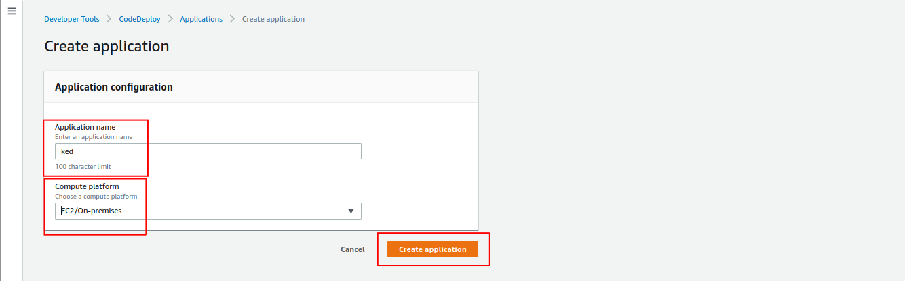

4. Vous êtes redirigé vers la page de `CodeDeploy` et un bandeau s'affiche pour vous notifier de la création de l'application `CodeDeploy`.

Cliquez ensuite sur **Create deployment group**
 
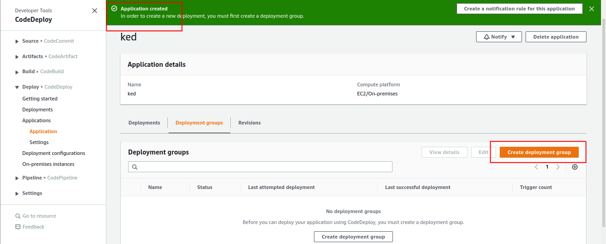

5. Remplissez les champs suivants:
   1. **Deployement group name**: "staging"
   2. **Service role**: cliquez sur la textArea et la liste des rôles que vous avez créé devrait s'afficher. Sélectionnez le rôle que vous avez créé juste avant, sinon copiez-collez son ARN. 

Descendez

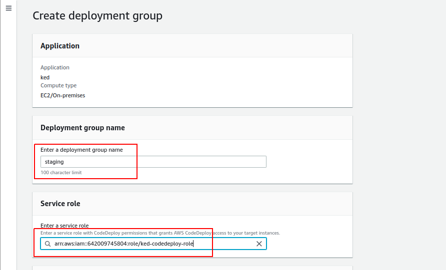

**Deployment type**: "In-place" \
**Environment configuration**: cochez "Amazon EC2 Auto Scaling groups" et sélectionnez le groupe d'auto-scaling de staging: "StagingEC2BasedInfra".

Descendez
 
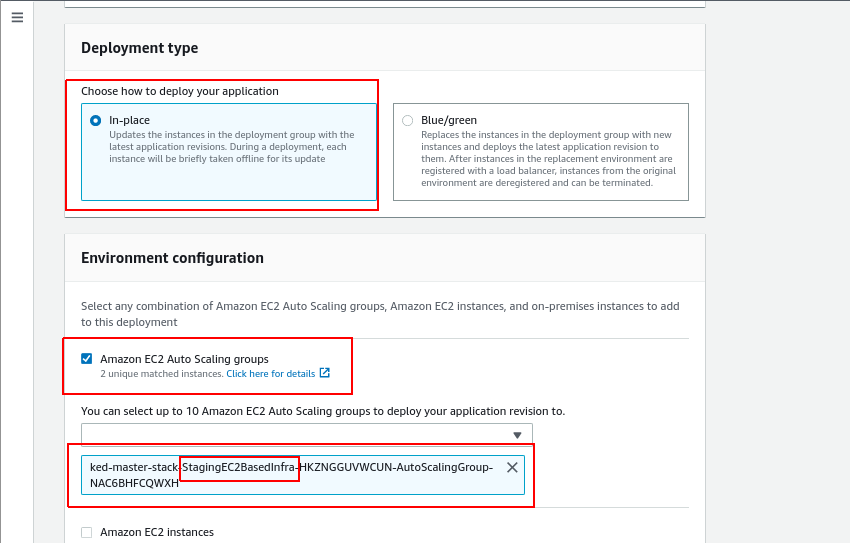

**Deployment settings**: "CodeDeployDefault.AllAtOnce", c'est très bien pour du staging \
**Load balancer**: décochez "Enable load balancer" 

Cliquez ensuite sur **Create deployment group**
 
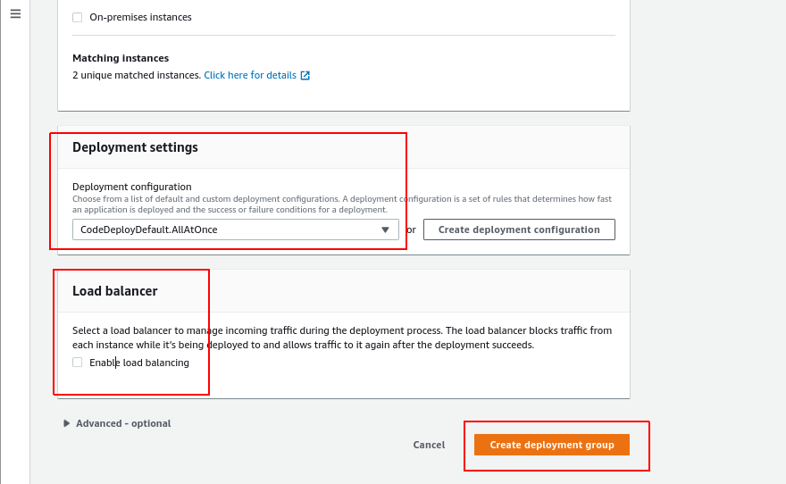

Vous êtes redirigés et un bandeau s'affiche, vous informant que le groupe de déploiement a bien été créé
 
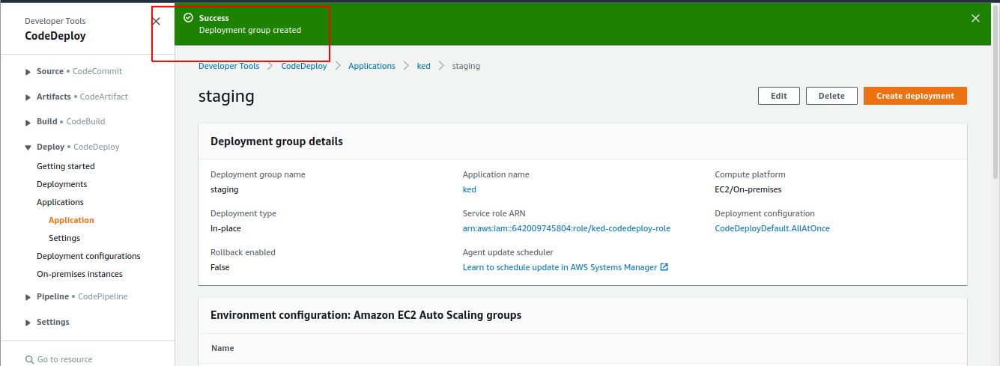

6. Ajout du stage "staging" à la pipeline

Retournez dans `CodePipeline`, sélectionnez la pipeline "ked" et cliquez sur "Edit"

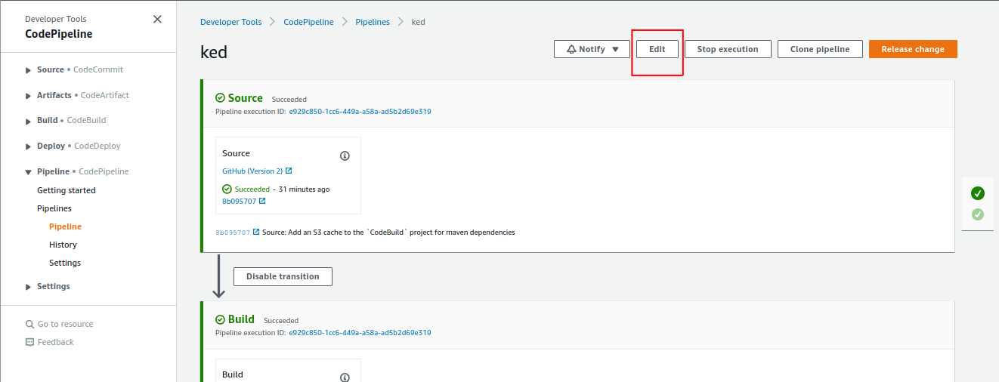

Tout en bas, cliquez sur "Add stage"
 
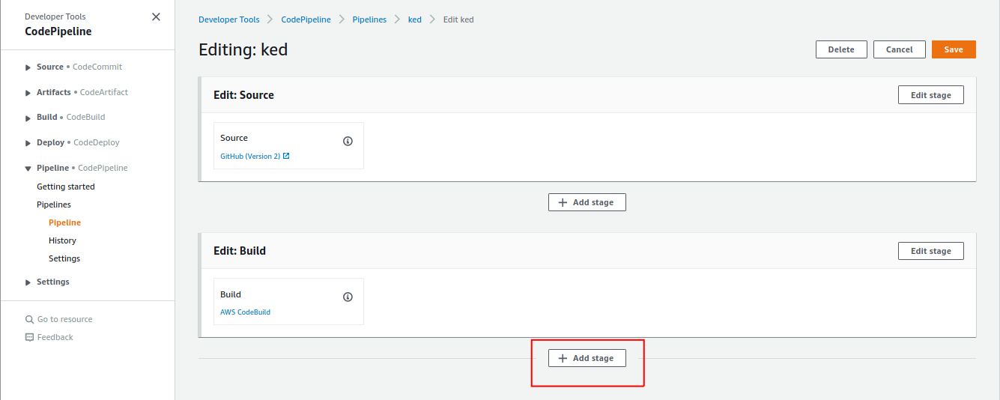

Donnez le nom "Staging" et cliquez sur "Add stage"
 


cliquez sur "Add action group" du groupe nouvellement créé
 


Remplissez les champs suivants:
- **Action name**: "Deploy"
- **Action provider**: "AWS CodeDeploy"
- **Input artifacts**: "BuildArtifact"
- **Application name**: "ked"
- **Deployment group**: "staging"
 
Cliquez ensuite sur **done**


Cliquuez sur **done**
 


Remontez tout en haut et cliquez sur **Save**
 


7. Effectuons une requête en "staging" et vérifions que rien n'est deja déployé

Dirigez-vous vers l'interface du service `EC2` et cliquez sur **Load Balancers**
 


Sélectionnez le load balancer de staging et récupérez son **DNS name**
 


effectuons des requêtes `curl` sur cette URL. \
On reçoit des réponses HTTP 502, ce qui est normal puisque rien n'est encore déployé
 


8. Création et modification des fichiers de build et déploiement pour le staging

Avant de pouvoir procéder au déploiement, nous allons avoir besoin de créer et modifier quelques fichiers.

Nous allons ajouter les fichiers suivants:
```
deployment/
├── appspec.yml
├── application.service
└── scripts
    ├── before_install.sh
    ├── start_server.sh
    ├── stop_server.sh
    └── validate_service.sh
```

- 8.1 créez le fichier `deployment/appspec.yml` suivant:

```yaml
version: 0.0
os: linux
files:
  - source: /deployment/application.service
    destination: /etc/systemd/system
  - source: /application.jar
    destination: /opt/application
file_exists_behavior: OVERWRITE
hooks:
  ApplicationStop:
    - location: deployment/scripts/stop_server.sh
      timeout: 10
      runas: root
  BeforeInstall:
    - location: deployment/scripts/before_install.sh
      timeout: 5
      runas: root
  ApplicationStart:
    - location: deployment/scripts/start_server.sh
      timeout: 60
      runas: root
  ValidateService:
    - location: deployment/scripts/validate_service.sh
      timeout: 20
      runas: root
```
cf slides pdf et une éventuelle future vidéo pour la présentation de ce fichier.

- 8.2 créez ensuite le fichier `deployment/application.service` suivant:

```unit file (systemd)
[Unit]
Description=application
After=syslog.target

[Service]
User=ubuntu
ExecStart=java -jar /opt/application/application.jar
SuccessExitStatus=143

[Install]
WantedBy=multi-user.target
```

- 8.3 créez ensuite le fichier `deployment/scripts/stop_server.sh` suivant:

```shell
#! /bin/bash
systemctl stop application || echo 0
```

- 8.4 créez ensuite le fichier `deployment/scripts/before_install.sh` suivant:

```shell
#! /bin/bash

# making the application working directory and configuration at the same time
mkdir -p /opt/application
```

- 8.5 créez ensuite le fichier `deployment/scripts/start_server.sh` suivant:

```shell
#! /bin/bash
systemctl daemon-reload
systemctl restart application
```

- 8.6 créez ensuite le fichier `deployment/scripts/validate_service.sh` suivant:

```shell
#! /bin/bash
PORT=8080
RETRY_INTERVAL_SECONDS=2
until curl -X GET "http://localhost:$PORT/actuator/health"
do
  echo "Application not listening yet on port $PORT. Retrying in $RETRY_INTERVAL_SECONDS second(s)..."
  sleep $RETRY_INTERVAL_SECONDS
done
```

commitez et pushez ces fichiers, ce qui aura pour effet de relancer la pipeline. 

Celle-ci devrait être verte au final


cliquez pour accéder au déploiement. Entouré en rouge l'id du déploiement
 


Descendez pour obtenir le status de déploiement sur les 2 instances dans le groupe d'auto-scaling. \
Cliquez sur **View events** 


Descendez et vous aurez le status et le détail de chaque étape du cycle de vie du déploiement `CodeDeploy` (sans prise en compte du load balancer). \
Encore une fois, voir la présentation pdf ou la future vidéo pour une présentation plus détaillée du cycle de vie des déploiement `CodeDeploy`.  


Effectuons une requête `curl` sur l'url du load balancer de staging.

On peut voir que les 2 instances EC2 nous répondent derrière le LB


---

## 5. Mise en place du stage de déploiement en production

branche de départ: `4-deploy-staging`

branche d'arrivée: `5-deploy-production`

cf section [Exécution](#exécution) pour éxécuter les scripts d'infra correspondant au manipulations de cette étape:

```shell
cd infra
make all APPLICATION_NAME=ked
```

Place aux manips !

### 5.1 Création du groupe de déploiement
1. Dirigez-vous vers l'interface de `CodeDeploy`. Cliquez sur "Create deployment group"


2. Remplissez les champs suivants: 
   1. **Deployment group name**: "production"
   2. **Service role**: sélectionnez le rôle créé dans la section [4.1 Création du rôle IAM](#41-création-du-rôle-iam)


3. Descendez et remplissez les champs suivants:
   1. cochez **Amazon EC2 Auto Scaling groups"
   2. sélectionnez le groupe d'auto-scaling de production


4. Descendez et remplissez les champs suivants:
   1. **Deployment settings**: `CodeDeployDefault.OneAtATime`
   2. **Load balancer**
      1. cochez **Enable load balancing**
      2. sélectionnez **Application Load Balancer or Network Load Balancer**
      3. **choose a target group**: "ked-production-tg"

Cliquez sur **Create deployment group**


### 5.2 Modification de la pipeline

1. Dirigez-vous dans l'interface de `CodePipeline` et sélectionnez la pipeline "ked". Cliquez sur **Edit**


2. Descendez tout en bas et cliquez sur **Add stage** après le stage "staging".

Nommez-le "Production"


3. Cliquez sur **Add action group**


4. Remplissez les champs suivants:
   1. **Action name**: "Approval"
   2. **Action provider**: "Manual Approval"

Cliquez sur **Done**


5. Remplissez les champs suivants:
   1. **Action Name**: "Deploy"
   2. **Action provider**: "AWS CodeDeploy"
   3. **Input artifacts**: "BuildArtifact"
   4. **Application name**: "ked"
   5. **Deployment group**: "production"

6. Cliquez sur **Done**


7. Cliquez sur **Done**


8. Cliquez sur **Save**


### 5.3 Exécution et suivi du déploiement
1. Dirigez vous dans l'interface du service **EC2**.
1. Cliquez sur **Load Balancers**
2. Sélectionnez **ked-production-lb**
3. Copiez le **DNS name**


2. éxécutez un `curl` sur le **DNS name** récupéré à l'étape précédente. Si vous n'avez pas deja effectué de déploiement, vous devriez recevoir une HTTP 502


3. Relancez la pipeline.
   1. Quand le déploiement sera arrivé au stage **Production**, approuvez l'action **Approval**
   2. Ensuite l'action **Deploy** commencera à s'éxécuter, cliquez sur **AWS CodeDeploy** ou **Details** pour consulter les détails du déploiement en cours
  


4. Le déploiement est "In progress". Cliquez sur l'id du déploiement pour avoir plus de détails


5. Puisque nous avons configuré le stage de déploiement **production** pour déployer sur une seule instance à la fois, le déploiement sur l'une des instances est dans l'état **Pending**.
   1. Cliquez sur l'instance dont le déploiement est dans l'état **In Progress**


6. Le déploiement est en cours
   1. Il y a des étapes supplémentaires dans le cycle de vie du déploiement, entourées en route. Cela puisque nous avons configuré le groupe de déploiement **production** pour être "load-balancer aware".
   2. Le déploiement sera "bloqué" à l'étape **BlockTraffic** d'une durée à peu près égale au paramètre `deregistration_delay.timeout_seconds` du target group ciblé par le groupe de déploiement.
   3. Le déploiement sera "bloqué" à l'étape **AllowTraffic** le temps de passer les health check du target group / load balancer, soit une durée à peu près égale à `HealthyThresholdCount` * `HealthCheckIntervalSeconds` 


7. Puisque nous déployons une instance à la fois en prod, une seule instance nous répond 


8. Une fois que le déploiement est fini sur la 1e instance, on passe à la seconde. Consultons les détails du déploiement sur cette seconde instance 


9. Toutes les étapes deviennent in fine vertes


10. Une fois le déploiement terminé sur les 2 instances, si nous requêtons le load balancer, les 2 instances vont nous répondre 


---

## 6. Suppression de l'infra

### 6.1 Suppression des ressources de la pipeline

1. Commencez par supprimer la pipeline `ked` dans l'interface `CodePipeline`. Désolé, l'auteur a oublié de faire un screenshot de cette étape.
2. Allez ensuite dans `settings/connections`, sélectionnez la connexion `ked` et cliquez sur **Delete**


3. Confirmez la suppression de la connexion github


4. Allez dans `CodeDeploy/applications` et cliquez sur **Dalete application**. Confirmez


5. Allez dans `IAM/roles`, tapez "ked" et sélectionnez les rôles créés manuellement ou automatiquement. Cliquez ensuite sur **Delete** et confirmez


6. Allez dans `IAM/policies` et supprimez aussi les policies créées lors des manips


7. Allez dans `Github`, cliquez sur l'icône de votre profil, puis sur **Settings**


8. Descendez et cliquez sur **Applications**


9. Dans l'onglet **Installed GitHub Apps**, repérez **AWS Connector for GitHub** et cliquez sur **Configure**


10. Descendez et cliquez sur **Uninstall**


11. Allez dans l'onglet **Authorized GitHub Apps**, repérez **AWS Connector for GitHub** et cliquez sur **Revoke**


Ca y est, vous avez supprimé *presque* toutes les ressources créées lors de la manips. Il nous reste à supprimer l'infra (groupes d'auto-scaling, réseau, etc.) 

### 6.2 Suppression de l'infra


```shell
cd infra
make delete-all APPLICATION_NAME=ked
```
